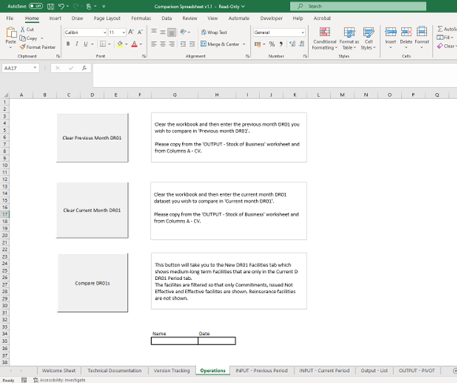

# VBA Queries and Dashboard

A data request came in explaining that as part of “the clean growth process, we currently label new transactions (from the MMR reports under new credit commitments) as clean growth or not clean growth.

I’m looking to streamline this process a little – would it be possible for us to now come to your team and request a list of new accounts for 6 months, every 6 months? Using the new credit commitments means that they don’t have the facility IDs to match the DR01. 

I’ve also tried using the DR02 to see business written in the last 6 months but it doesn’t seem to match up – what would you recommend as the best process? Just to note, this isn’t an urgent request so no rush on this.”

To address this, I arranged a meeting with the end user and started working based on that call. I created an Excel spreadsheet that includes a welcome page, a Technical Documentation sheet, and a Version Tracking sheet for reference. This will help us track any amendments that may be needed in the future.

A screenshot of the Operations page is attached below.

For this page, I created the following queries as the spreadsheet will be used on a regular basis:

Sub ClearColumns(strSheetName, strStartColumn, strEndColumn)

On Error GoTo Handler

Dim intEndRow As Integer

'   Delete everything between the specified columns. Preserves heading

    Sheets(strSheetName).Unprotect (strPassword)
    Sheets(strSheetName).Select
'   check that there is data in this sheet

    If Worksheets(strSheetName).Range("A1") = "" Then
        If strSheetName = strCurrentPeriodSheet Then
            intEndRow = Application.CountA(Worksheets(strSheetName).Range("CW:CW"))
            If intEndRow > 2 Then
                Range("CW3:CW" & intEndRow).Select
                Selection.ClearContents
                With Selection.Interior
                    .Pattern = xlNone
                    .TintAndShade = 0
                    .PatternTintAndShade = 0
                End With
                Range("CW3:CW" & intEndRow).Locked = True
                Range(A1).Select
            End If
        End If
        Exit Sub        ' no need to continue with the macro
    Else
        intEndRow = Application.CountA(Worksheets(strSheetName).Range("A:A"))
    
        Range(strStartColumn & "2:" & strEndColumn & intEndRow).Select
        Selection.ClearContents
    '   Remove all colouring
        With Selection.Interior
            .Pattern = xlNone
            .TintAndShade = 0
            .PatternTintAndShade = 0
        End With
        If strSheetName = strCurrentPeriodSheet Then
            Range("CW3:CW" & intEndRow).Select
            Selection.ClearContents
            With Selection.Interior
                .Pattern = xlNone
                .TintAndShade = 0
                .PatternTintAndShade = 0
            End With
            Range("CW3:CW" & intEndRow).Locked = True
        End If
    End If
   'Sheets(strSheetName).Protect (strPassword)
    
done:
    Exit Sub
    
Handler:
'   Turn on screen updating
   If Application.ScreenUpdating = False Then
        Application.ScreenUpdating = True
    End If
    
    DisplayError Err.Source, Err.Description, "Module ClearColumns.Topmost"
    
End Sub

Sub ClearSignature()

'   Clears electronic signature
    Sheets("Operations").Unprotect (strPassword)
    Range("Signed_By").ClearContents
    Range("Signed_On").ClearContents

End Sub

To compare the two datasets, the user will need to manually copy and paste the relevant month into the ‘INPUT – Previous Period’ and ‘INPUT – Current Period’ sections, allowing the dataset to refresh. The query is as follows:

sub to copy the user defined purple cells on OUTPUT Stock of Business sheet

Sub CopyUserDefinedCells(strTargetSheetName)

    Dim nRowsOutput As Integer
    Dim StartCol As String
    Dim EndCol As String
    
    '   initialise variables
    nRowsOutput = Application.CountA(Worksheets(strTargetSheetName).Range("A:A"))
    StartCol = "CW"
  
    '   select taget sheet
    Sheets(strTargetSheetName).Select
    Worksheets(strTargetSheetName).Unprotect (strPassword)
    
    '   clear rows 3 - end so that can do a clean copy
    Range(StartCol & "3:" & StartCol & nRowsOutput).Clear
    
    '   now copy the formulas from row 2 to the end of the current list
    Range(StartCol & "2").Copy _
    Destination:=Range(StartCol & "3:" & StartCol & nRowsOutput)
    Worksheets(strTargetSheetName).Protect (strPassword)
    
    
End Sub

'   this sub will refresh the pivot table on the sheet OUTPUT - PIVOT
'   L Balogun Jan 24

Sub RefreshPivot()

    Dim rngDataArea As Range        ' holds the range that holds the new pivot table data
    Dim intEndRow As Integer        ' holds  length of data in 'OUTPUT - list' sheet

    intEndRow = Application.CountA(Worksheets(strOutputSheet).Range("A:A"))
    
    If intEndRow < 2 Then
        Exit Sub
    Else
        Set rngDataArea = Worksheets(strOutputSheet).Range("A1:CV" & intEndRow)
        Sheets("OUTPUT - PIVOT").PivotTables("PivotOutput").ChangePivotCache _
        ActiveWorkbook.PivotCaches.Create(SourceType:=xlDatabase, SourceData:=rngDataArea, Version:=xlPivotTableVersion15)
    End If

End Sub

To ensure correct usage, I added an error query to alert the user if they paste the DR01 into the wrong cell. Once this is done correctly, the end user can click ‘Compare DR01s’ to see what is new or different between the two DR01s. This will provide insights into the stage of the facility ID, the number of accounts under the facility ID, the industry linked to the facility ID, the contract value, maximum liability, and the new premium amount at pricing (GBP).

### Outcome

This tool was successfully delivered to the end-user team in January 2024. Since then, they have only reached out once with a query about using the spreadsheet correctly. I guided them on how to resolve their issue. The tool has significantly reduced their manual labour hours by allowing them to efficiently compare DR01 datasets from previous years.
